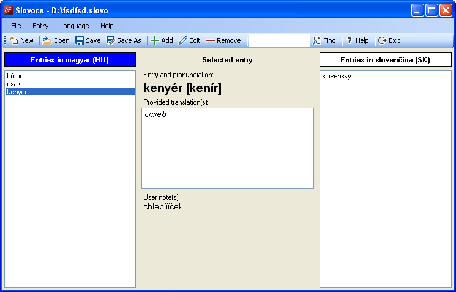

# Slovoca

Custom vocabulary creation tool

## About

Slovoca is a simple but powerful portable (can be launched for example from a USB flash drive) software tool designed for anyone who is learning one or more foreign languages. It allows you to create and maintain your own customized vocabulary of all new foreign words and expressions you have learned. Each of them can be supplied with its phonetic transcription, one or more translations and your personal annotations. This way you can easily get back to anything you have already learned and refresh your memory by recalling desired vocabulary entry's translations together with all the notes, annotations and phonetic transcription you provided the entry with.

### Scalability and portability

Slovoca enables you to create as many customized vocabularies as you wish. Each vocabulary you create with Slovoca can be stored in one single project file that you can take with you anywhere, for example on a USB flash drive. Then, you can easily update it using Slovoca on any other computer that meets the Slovoca's hardware and software requirements (see sections below).

### Supported languages

Each vocabulary is defined by two languages: your **native language** and the **foreign language** you are learning the words and expressions of. When you create a new vocabulary project in Slovoca, you have to define these two languages by selecting them from the provided list of supported languages. This list may vary from one computer to another depending on the languages and cultures supported by the version of .NET Framework you are using. 

### Localization

Currently supported display languages in Slovoca:

| Language | Code (decimal) |
|---|---|
| English (United States) | 1033 |
| Slovak (Slovakia) | 1051 |

## Usage

### Hardware and software requirements

Slovoca can run on any computer running **at least Windows XP with .NET Framework 4.0** and newer installed.

### Installation

Since it is a portable application, Slovoca does not need to be installed. Just download the latest release and extract the obtained ZIP archive to a folder on your computer's hard drive, your USB flash drive or any other type of (removable) storage.

## Author and license

This software tool was developed by Marek Felsoci (student at the [University of Strasbourg](http://www.unistra.fr) in France) and is licensed under the terms of the GNU General Public License version 2 (see [license file](LICENSE)).

## Further information

For more information about Slovoca, please, refer to [the project's website](https://felsocim.github.io/Slovoca/).

